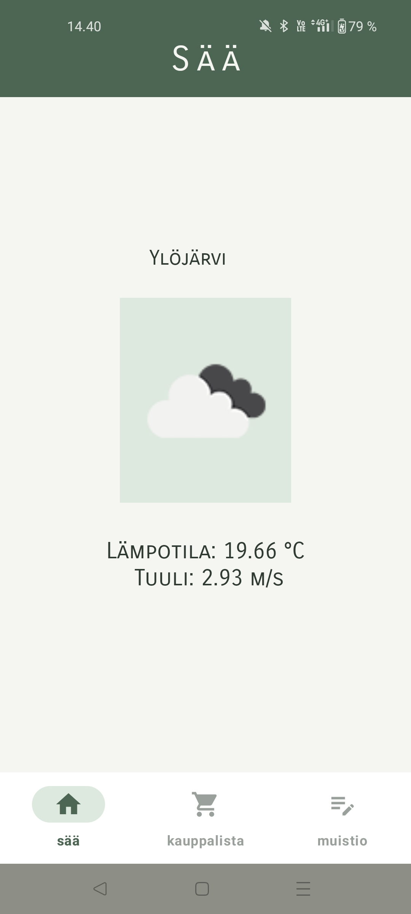
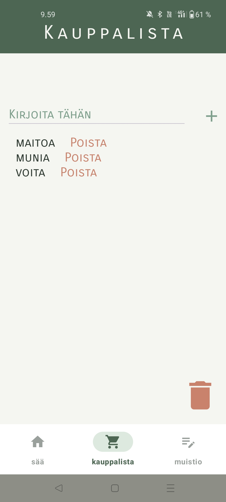
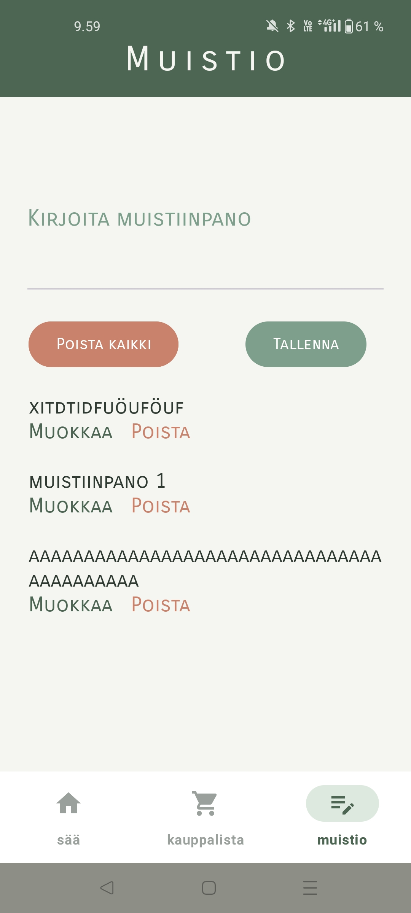

# Arkisovellus

  
  
  

## Yleiskuvaus

Arkisovellus on Kotlinilla toteutettu Android-sovellus, joka kokoaa yhteen kolme arjessa hyödyllistä toimintoa:

- sääennusteen
- kauppalistan
- muistion

Sovelluksen tavoitteena oli harjoitella Android-sovelluskehitystä, käyttöliittymien rakentamista, REST-rajapintojen hyödyntämistä sekä tiedon paikallista tallentamista.

## Ominaisuudet

### Sää

- Hakee käyttäjän sijainnin
- Näyttää nykyisen sään OpenWeatherMap-rajapinnan avulla
- Näyttää lämpötilan, tuulen nopeuden sekä sääkuvakkeen
- Pyytää sijaintioikeudet tarvittaessa

### Kauppalistan toiminnot

- Uusien tuotteiden lisääminen
- Yksittäisten tuotteiden poistaminen
- Koko listan tyhjentäminen
- Sovellus tallentaa tiedot laitteen sisäiseen tallennustilaan

### Muistion toiminnot

- Uusien muistiinpanojen lisääminen
- Olemassa olevien musitiinpanojen muokkaaminen
- Yksittäisten muistiinpanojen poistaminen
- Kaikkien muistiinpanojen poistaminen kerralla
- Tallentaa tiedot laitteen sisäiseen tallennustilaan

## Käytetyt teknologiat

- Kotlin
- Android SDK
- Fragmentit
- BottomNavigationView
- View Binding
- OkHttp
- OpenWeatherMap API
- Fused Location Provider
- Laitteen sisäinen tiedostotallennus

## Sovelluksen rakenne

Sovellus koostuu kolmesta näkymästä:

- Sää
- Kauppalista
- Muistio

Näkymien välillä siirrytään BottomNavigationView-komponentin avulla.

## Tekijä

Vilja Korkala

